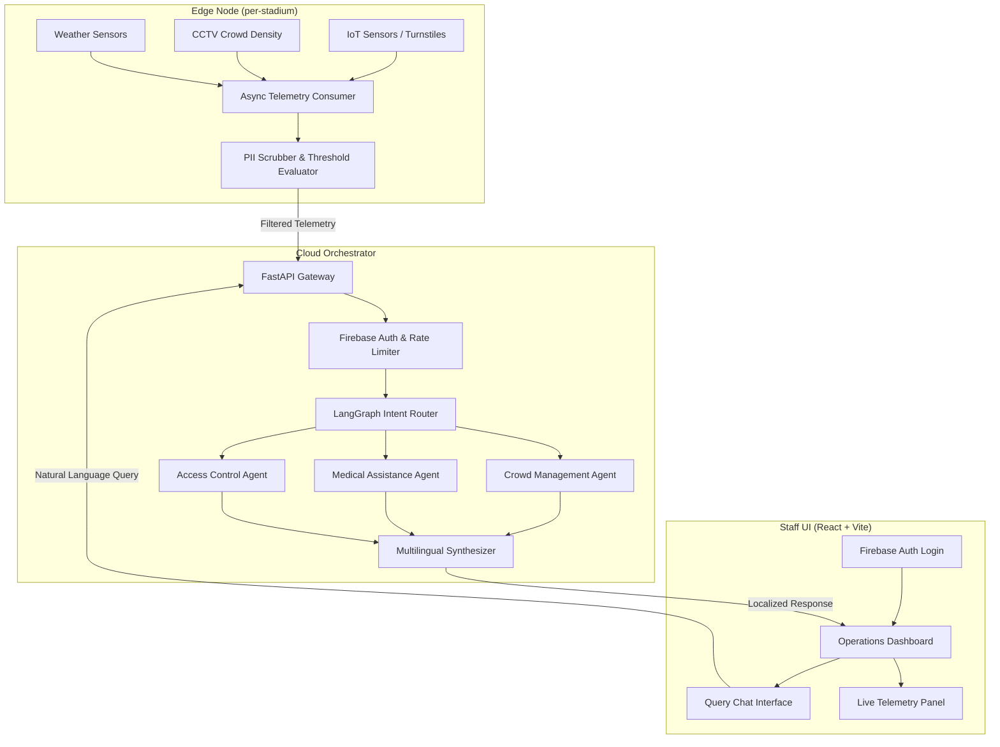

# OmniCrew AI

> **GenAI-powered decision-support co-pilot for stadium ground staff during FIFA World Cup 2026.**

OmniCrew AI enables ground staff — medics, ushers, security, and command-center operators — to issue natural-language queries (e.g. *"Gate C is flooded, where do I send the overflow?"*) and receive localized, actionable instructions fused with live telemetry from IoT sensors, weather feeds, and crowd-density estimators.

**Live Demo:** [https://omnicrew-ai-2026.web.app](https://omnicrew-ai-2026.web.app)

---

## Architecture



### Topology: Decentralized Edge-Cloud

| Layer | Responsibility |
|-------|---------------|
| **Edge** (`app/edge/`) | Ingest IoT streams, scrub PII, evaluate thresholds, compress context |
| **Cloud** (`app/agents/`) | Intent routing, sub-agent tool calling, multilingual synthesis |
| **API** (`app/main.py`) | FastAPI gateway, Firebase Auth verification, rate limiting, endpoint routing |
| **Frontend** (`web/`) | React + Vite staff dashboard with Firebase Auth login, chat interface, live telemetry panel |
| **Security** (`app/utils/`) | Crypto helpers, input sanitization, injection detection |

**Key boundary**: `agents/` never imports from `edge/` directly — it receives post-filtered data via the dependency injection layer.

---

## Prerequisites

- **Python 3.11+**
- **Node.js 20+** (for the staff UI)
- A **Google Gemini API key** (for LLM inference)
- A **Firebase project** with Email/Password authentication enabled

---

## Setup

### Backend

```bash
# Enter the project
cd omnicrew

# Create a virtual environment
python3 -m venv .venv && source .venv/bin/activate

# Install dependencies
pip install -r requirements.txt
```

### Frontend

```bash
cd web
npm install
```

### Environment Variables

Create a `.env` file at the project root (see `.env.example`):

| Variable | Required | Default | Description |
|----------|----------|---------|-------------|
| `OMNICREW_GOOGLE_API_KEY` | ✅ | — | Google Gemini API key |
| `OMNICREW_LLM_MODEL_NAME` | — | `gemini-2.0-flash` | Gemini model name |
| `OMNICREW_LLM_TEMPERATURE` | — | `0.2` | LLM sampling temperature |
| `OMNICREW_FIREBASE_PROJECT_ID` | — | `omnicrew-ai-2026` | Firebase project ID for token verification |
| `OMNICREW_EDGE_CROWD_THRESHOLD` | — | `800` | Turnstile count alert threshold |
| `OMNICREW_EDGE_TEMPERATURE_MAX_C` | — | `42.0` | Heat alert threshold (°C) |
| `OMNICREW_RATE_LIMIT_RPM` | — | `60` | Max requests/minute per user |
| `OMNICREW_SERVER_HOST` | — | `0.0.0.0` | Uvicorn bind host |
| `OMNICREW_SERVER_PORT` | — | `8000` | Uvicorn bind port |

### Firebase Credentials (Local Dev)

For local development, the backend needs a Firebase Admin service account key to verify ID tokens:

1. Download the key from the [Firebase Console](https://console.firebase.google.com/project/omnicrew-ai-2026/settings/serviceaccounts/adminsdk)
2. Save it as `sa-key.json` in the project root (this file is `.gitignore`d)
3. The backend auto-discovers it on startup — no env var needed

Alternatively, set `GOOGLE_APPLICATION_CREDENTIALS=/path/to/sa-key.json`.

On GCP infrastructure (Cloud Run, Cloud Functions), credentials are automatic via Application Default Credentials.

**Example `.env`:**

```env
OMNICREW_GOOGLE_API_KEY=your-gemini-api-key-here
OMNICREW_LLM_MODEL_NAME=gemini-3.5-flash
OMNICREW_FIREBASE_PROJECT_ID=omnicrew-ai-2026
```

---

## Running Locally

### 1. Start the Backend

```bash
uvicorn app.main:app --reload --port 8000
```

### 2. Start the Frontend

```bash
cd web
npm run dev
```

Then visit [http://localhost:5173](http://localhost:5173). The Vite dev server proxies `/api/*` requests to the backend at `localhost:8000`.

### 3. Log In

Use one of the seeded test accounts:

| Email | Password | Role |
|:------|:---------|:-----|
| `medic@omnicrew.test` | `OmniMedic2026!` | 🏥 Medic (Gate-A) |
| `usher@omnicrew.test` | `OmniUsher2026!` | 🎫 Usher (Gate-C) |
| `security@omnicrew.test` | `OmniSecurity2026!` | 🛡️ Security (Gate-B) |
| `cmdctr@omnicrew.test` | `OmniCommand2026!` | 📡 Command Center (HQ) |

To seed these accounts in a new Firebase project:
```bash
GOOGLE_APPLICATION_CREDENTIALS=sa-key.json python3 scripts/seed_users.py
```

---

## Running Tests

```bash
python3 -m pytest tests/ -v
```

All tests run hermetically — no real API calls, no real IoT streams, no real Firebase Auth. The LLM and auth are fully mocked.

---

## Project Structure

```
omnicrew/
├── app/
│   ├── __init__.py
│   ├── main.py                 # FastAPI app, middleware, routes, Firebase init
│   ├── config.py               # Pydantic Settings (env-var driven)
│   ├── dependencies.py         # Firebase Auth, rate limiter, LLM factory
│   ├── diagnostics.py          # GenAI usage tracking endpoint
│   ├── agents/
│   │   ├── __init__.py
│   │   ├── router.py           # LangGraph intent router
│   │   └── tools.py            # @tool functions (Crowd, Medical, Access)
│   ├── edge/
│   │   ├── __init__.py
│   │   ├── filter.py           # PII scrubbing, threshold eval
│   │   └── stream.py           # Mocked async IoT consumer
│   └── utils/
│       ├── __init__.py
│       ├── security.py         # Crypto, sanitization, injection detection
│       └── genai_telemetry.py  # LLM call instrumentation
├── web/                        # React + Vite staff UI
│   ├── src/
│   │   ├── App.tsx             # Dashboard, login, chat interface
│   │   └── lib/
│   │       ├── firebase.ts     # Firebase client SDK init
│   │       └── api.ts          # Backend API client (Bearer token auth)
│   ├── index.html
│   └── vite.config.ts          # Dev proxy config (/api → localhost:8000)
├── scripts/
│   ├── seed_users.py           # Create test Firebase Auth accounts
│   └── verify_genai_usage.sh   # Verify live GenAI integration
├── tests/
│   ├── conftest.py             # Shared fixtures, mock auth, mock LLM
│   ├── test_api.py             # FastAPI integration tests
│   ├── test_agent.py           # Routing & tool-call tests
│   ├── test_edge.py            # PII scrubbing & edge filter tests
│   └── test_genai_live.py      # Live GenAI integration test (opt-in)
├── firebase.json               # Firebase Hosting + Functions config
├── main.py                     # Firebase Functions adapter (ASGI→WSGI)
├── requirements.txt
├── sa-key.json                 # Firebase Admin SA key (gitignored)
└── README.md
```

---

## Authentication

OmniCrew AI uses **Firebase Authentication** (Email/Password) for staff login.

- **Frontend**: The Firebase Client SDK handles login and token refresh. Each API request attaches the ID token as `Authorization: Bearer <token>`.
- **Backend**: The Firebase Admin SDK verifies the JWT, extracts the user's `role` and `gate` from [custom claims](https://firebase.google.com/docs/auth/admin/custom-claims), and enforces role-based access control.
- **No shared secrets**: The staff UI never sees API keys, LLM credentials, or any server-side secret. The Firebase Web API key is a public client identifier, not a secret.

### Role-Based Access Control

| Role | Permissions |
|------|-------------|
| `medic` | Query the AI for medical guidance |
| `usher` | Query the AI for crowd routing |
| `security` | Query the AI for access control |
| `command-center` | All of the above + live telemetry dashboard |

Roles are embedded in the Firebase ID token as custom claims and enforced server-side — they cannot be spoofed by the client.

---

## Security Guardrails

| Guardrail | Implementation |
|-----------|---------------|
| **Firebase Auth** | `dependencies.py` — JWT verification via Firebase Admin SDK. No shared secrets or API keys in the client. |
| **PII Scrubbing** | `edge/filter.py` — deterministic regex for phone, email, name, SSN, credit card. Applied before any data reaches the LLM. |
| **Role-Based Access** | `dependencies.py` — roles from Firebase custom claims, enforced server-side. Telemetry restricted to command-center. |
| **Rate Limiting** | `dependencies.py` — in-memory token-bucket per user UID. |
| **Prompt Injection Hardening** | Isolated system instructions, `<user_query>` delimiters, heuristic detector for 6 attack patterns, schema validation on all tool outputs. |
| **Input Sanitization** | `utils/security.py` — strips control characters, null bytes, truncates to 2000 chars. |
| **No Hardcoded Secrets** | All secrets via env vars / `config.py`. SA key auto-discovered, gitignored. |

---

## Generative AI Usage

This project makes genuine calls to Google Gemini to power the orchestrator layer. To verify that the live deployment is using GenAI (and not returning canned strings), check the diagnostics endpoint:

```bash
# Fetch the last 50 LLM calls with exact token counts and latency
curl -X GET "https://omnicrew-ai-2026.web.app/api/diagnostics/genai-usage" \
     -H "Authorization: Bearer <your-id-token>"
```

### GenAI Touchpoints

| Component | File | Responsibility |
|---|---|---|
| **Intent Routing** | `app/agents/router.py` | Given the telemetry and query, decides which tool(s) to call. |
| **Argument Extraction** | `app/agents/router.py` | Extracts structured arguments (e.g., location, severity) for the tool schema. |
| **Multilingual Synthesis** | `app/agents/router.py` | Combines tool outputs with operational context to generate a localized, translated response in the staff member's language. |
| **Telemetry Logger** | `app/utils/genai_telemetry.py` | Transparently intercepts every LLM call, logging token usage and latency. |

---

## Deployment (Firebase)

The frontend is deployed to **Firebase Hosting** (free Spark tier). The backend is designed to run as a **Firebase Cloud Function** (Python, 2nd gen) which requires the **Blaze** (pay-as-you-go) plan.

### Deploy Frontend Only (Spark Plan)

```bash
cd web && npm run build && cd ..
firebase deploy --only hosting --project omnicrew-ai-2026
```

### Deploy Full Stack (Blaze Plan Required)

```bash
cd web && npm run build && cd ..
firebase deploy --project omnicrew-ai-2026
```

### Firebase Pricing Notes

| Service | Plan | Notes |
|---------|------|-------|
| Firebase Auth (Email/Password) | **Spark (Free)** | Up to 50,000 MAUs |
| Firebase Hosting | **Spark (Free)** | 10 GB storage, 360 MB/day transfer |
| Cloud Functions (Python) | **Blaze** | Required for backend deployment |

---

## License

Internal — FIFA World Cup 2026 Operations.
